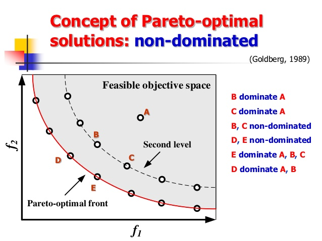
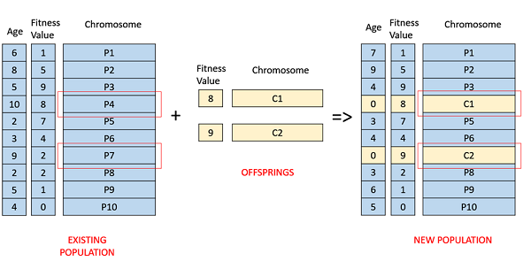

# Ordonnancement multi-objectif des tâches dans les environnements cloud-fog

Notre projet formule un problème d'optimisation multi-objectif pour l'ordonnancement des tâches dans un environnement cloud-fog, en considérant le compromis entre la minimisation du makespan (temps d'exécution total) et le coût total. le problème est modélisé sans agréger les fonctions objectifs, permettant ainsi l'exploration du front de pareto pour des solutions optimales.

## Introduction

L'ordonnancement des tâches dans les environnements cloud-fog consiste à répartir efficacement les tâches sur les différents nœuds de calcul disponibles, en tenant compte des contraintes de ressources et de performance. ce projet se concentre sur l'optimisation de deux objectifs clés : la minimisation du temps d'exécution total (makespan) et la minimisation du coût total. pour résoudre ce problème d'optimisation multi-objectif, nous utilisons l'algorithme génétique de tri non dominé ii (nsga-ii), implémenté en python sans l'utilisation de bibliothèques externes.

## Formulation du problème

Le problème est formulé avec les paramètres, variables de décision, fonctions objectifs et contraintes suivants :

### Paramètres

- $T$ : ensemble de tâches indépendantes
- $N$ : ensemble de nœuds de traitement, y compris les nœuds cloud et fog

### Fonctions objectifs

- minimiser le makespan : $\min f_1 = \max \left( \sum_{T_k} \left( \frac{\text{longueur}(T_k)}{\text{tauxCPU}(N_i)} \right) \right)$
  - $\text{longueur}(T_k)$ : longueur de la tâche $T_k$
  - $\text{tauxCPU}(N_i)$ : taux de traitement du nœud $N_i$

- minimiser le coût total : $\min f_2 = \sum_{T_k} (\text{coûtMin}(T_k))$
  - $\text{coûtMin}(T_k)$ : coût minimal d'exécution de la tâche $T_k$

### Contraintes

- chaque tâche doit être assignée à exactement un nœud
- contraintes de capacité pour chaque nœud
- contraintes de bande passante pour chaque nœud

la variable de décision binaire $x_{ki}$ indique si la tâche $T_k$ est exécutée sur le nœud $N_i$.

## Approche de résolution

Le problème est résolu en utilisant l'algorithme génétique de tri non dominé ii (nsga-ii), une technique d'optimisation multi-objectif qui explore le front de pareto sans agréger les fonctions objectifs. nsga-ii est un algorithme évolutionnaire qui maintient une population de solutions potentielles et les améliore itérativement en appliquant des opérateurs de sélection, de croisement et de mutation. l'algorithme utilise le concept de dominance de pareto pour classer les solutions et favoriser la diversité dans la population.

Dans ce projet, nous implémentons nsga-ii en python sans utiliser de bibliothèques externes. les principaux composants de l'algorithme sont :

- classe `taskoffloadingproblem` : définit l'instance du problème avec les matrices de coût et de temps d'exécution.
- méthode `evaluate` : évalue les fonctions objectifs et les contraintes pour une population donnée.
- fonction `dominates` : vérifie si une solution en domine une autre.
- fonction `non_dominated_sort` : effectue un tri non dominé sur une population.
- fonction `crowding_distance` : calcule la distance de crowding pour un ensemble de solutions.
- fonction `nsga2` : implémente la boucle principale de l'algorithme nsga-ii.
- fonction `tournament_selection` : effectue une sélection par tournoi pour sélectionner les parents pour la reproduction.
- fonction `crossover` : effectue un croisement à deux points sur les parents sélectionnés.
- fonction `mutate` : effectue une mutation bit-flip sur un individu.

les paramètres spécifiques de l'algorithme, tels que la taille de la population, le nombre de générations, les probabilités de croisement et de mutation, peuvent être ajustés dans le code pour optimiser les performances.

## Utilisation

1. définir l'instance du problème en fournissant les matrices de coût et de temps d'exécution (C et B).
2. ajuster les paramètres de l'algorithme (taille de la population, nombre de générations, probabilités de mutation et de croisement) si nécessaire.
3. exécuter le script pour effectuer l'optimisation et visualiser les résultats.

## Perspectives pour améliorer le projet 

Les extensions potentielles de ce projet incluent :

- considérer des objectifs ou des contraintes supplémentaires.
- comparer différents algorithmes d'optimisation multi-objectif.
- appliquer l'approche à des environnements cloud-fog réels.
- optimiser et améliorer l'implémentation actuelle de nsga-ii.
